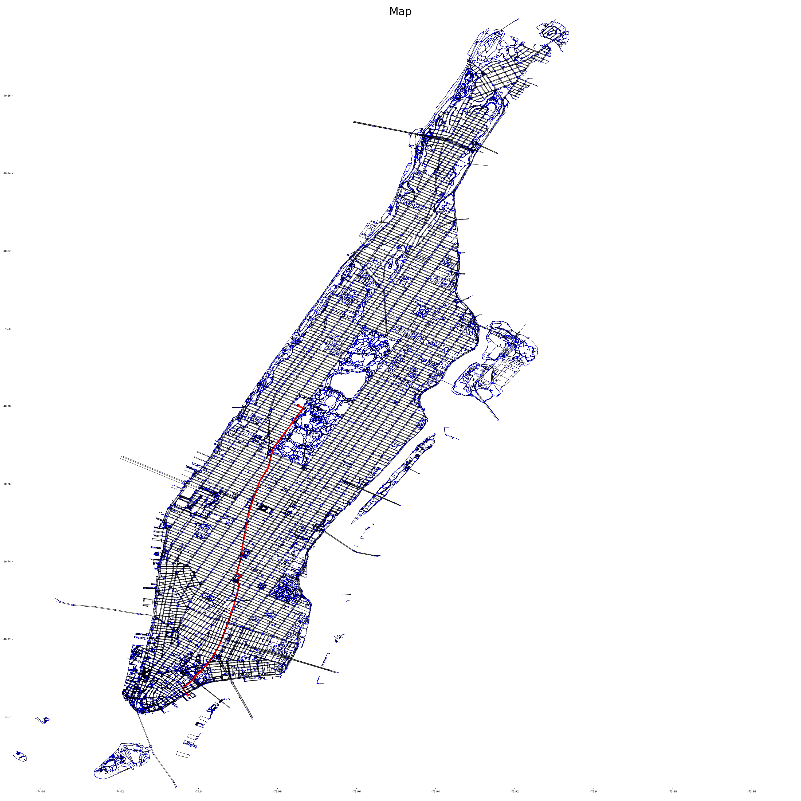

# OSMGraph

:warning: This is experimental software and pre-release (below v1.0). The API is subject to change. :warning:




`osmgraph` is a crate for quickly fetching data from OpenStreetMap (OSM) and formatting this data
into a graph data structure that can be used for various computer science tasks and problems.

[OpenStreetMap](https://www.openstreetmap.org/) is a free wiki world map. All of the data is
created and shared by users in a similar way to Wikipedia. The data is free to use under an
open license which you can find [here](https://www.openstreetmap.org/copyright).

This crate queries the OverpassAPI which is a *free to use* API for getting OSM data. I caution
users of this crate to not accidentally spam their server with very large requests. In general,
try to query once and then save the result locally while you are developing. The query language
that Overpass uses is known as the Overpass Query Language and you can learn more about how to
use it [here](https://wiki.openstreetmap.org/wiki/Overpass_API/Overpass_QL).

A `graph` in the context of computer science and mathematics is a structure consisting of a set
of nodes and edges. Nodes can represent anything. Edges represent a connection between two nodes.
In the context of maps, nodes represent some point on the globe, and an edge represents a way
that you can move between these nodes (a highway, a road, a sidewalk). Some edges can be
directed and the notion of a directed graph is useful for representing one-way streets;
however, in this iteration of the crate, we do not support one-way roads. Coming soon!

The graph part of this library heavily relies on the [petgraph](https://docs.rs/petgraph/latest/petgraph/index.html)
crate. This gives us an efficient interface for dealing with graphs and some algorithms (such
as A*) for free.

### Example

```rust
use osmgraph::graph::{OSMGraph, create_graph};
use osmgraph::overpass_api::{OverpassResponse, QueryEngine};

use serde_json::Value;

let engine = QueryEngine::new();

// Query to fetch all data related to "Selinsgrove" town in Pennsylvania
let query = String::from(r#"
    [out:json];
    area[name="Selinsgrove"]->.searchArea;
    (
      way(area.searchArea);
      node(area.searchArea);
    );
    out body;
    >;
    out skel qt;
"#);

// Make the request and get the resulting data in a raw string
let response: String = engine.query_blocking(query)
    .expect("Was not able to make request!");

// Parse json
let json: OverpassResponse = serde_json::from_str(&response)
    .expect("Was not able to parse data from json!");
let elements: &Vec<Value> = json.elements().as_array()
    .expect("Was not able to retrieve elements from json!");

//Create graph
let g: OSMGraph = create_graph(elements)
    .expect("Was not able to create graph from json!");
```
